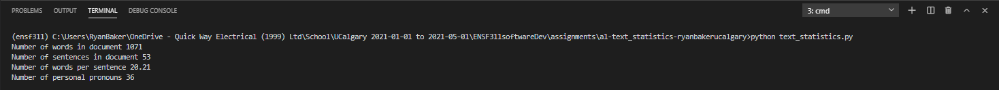
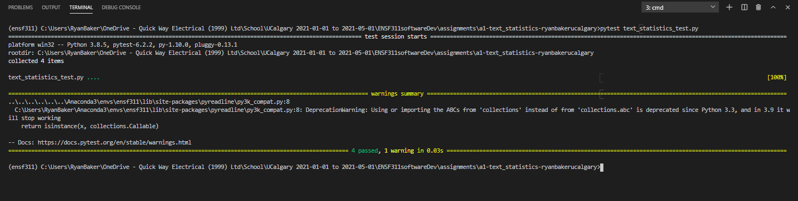

# a1-text_statistics
Reading text from file to print simple statistics using string methods

Author: Ryan Baker

# Problem statement
According to Wikipedia, The Feynman Lectures on Physics are likely the most popular physics books ever written. We would like to understand better why that is. Maybe it is related to how the text is structured. The goal of this exercise is to analyze the text in _Chapter 1.1 Introduction_ of the Feynman Lectures available here http://www.feynmanlectures.caltech.edu/I_01.html

Design a program that reads this section from the text file `feynman.txt`, uses functions outlined in `text_statistics.py`, and prints the following information:
- Number of words in the text
- Number of sentences in the text
- Average number of words per sentence
- Number of personal pronouns: I, me, my, you, we

The output of the program needs to be:
```
Number of words in document 1071
Number of sentences in document 53
Number of words per sentence 20.21
Number of personal pronouns 36
```

# What to do
Implement the functions as outlined in `text_statistics.py` to produce the output shown above. Document your code. Follow the [style guide](StyleGuide.md). Use git to track your changes. Commit working portions of code as you develop. Test your code by running `pytest -v text_statistics_test.py`. All tests should pass.

Create a screenshot of your program running. Create a second screenshot of test running. Edit `README.md` (this file) and include the screenshots and instructions how to run your code/tests in the _How to run this program_ section below (similar to `a0-classroom`). 

In the section *Reflection*, include what you liked or disliked; found interesting, confusing, challenging, motivating while working on this assignment.

Make sure final version of `text_statistics.py`, `feynman.txt`, `README.md`, `screenshot-program.png` and `screenshot-tests.png` are committed to git and pushed to github. 

# How to run this program
Download the repo, ensure the anaconda python ensf311 virtual environment is installed. Open a terminal, make the repo the active directory, and type 'python text_statistics.py' (without quotes). The text statistics of the file 'feynman.txt' will be printed by the python interpreter within the terminal window. To run the test file, type 'pytest text_statistics.py' from the same directory. See screenshots for examples. 

Running text_statistics.py:



Running text_statistics_test.py:



# Reflection
Overall, I enjoyed the assignment. It was a nice python refresher! Some useful things I re-learned were:

* List comprehensions
* String methods
* f-strings and number formatting in python

